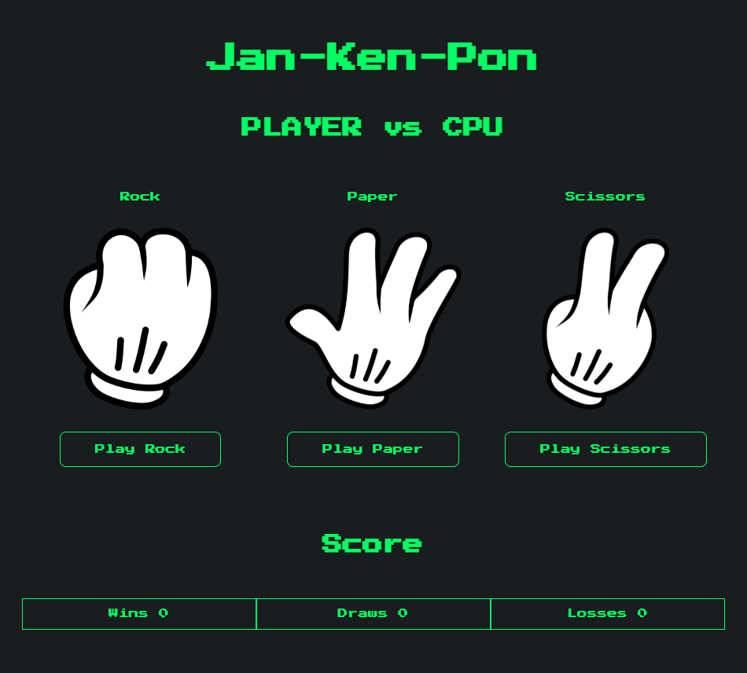

<h1 align="center">Jan-Ken-Pon</h1>

    
    
    
    
    
    

## Features

- Implementation of the MVC pattern with Spring.
- Data persistence through JDBC and PostgreSQL.
- Fully responsive layout with plain CSS.
- Support for containers from Docker Compose.

## Project Dependencies

### Spring Boot

- Spring Boot DevTools
- Docker Compose Support
- Spring Web
- Thymeleaf
- JDBC API
- PostgreSQL Driver

## Screenshots

 

    
    

## License

This project is released under the [MIT License](./LICENSE.md).