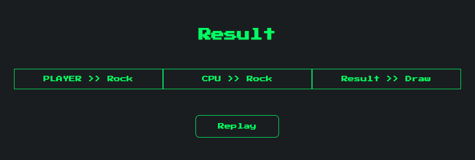

<h1 align="center">Jan-Ken-Pon</h1>

    
    
    
    
    
    

## Features

- MVC pattern with Spring Web.
- Data persistence through JDBC and PostgreSQL.
- Responsive layout with plain CSS.
- Support for containers from Docker.

## Project Dependencies

### Spring Boot

- Spring Web
- JDBC API
- PostgreSQL Driver
- Thymeleaf
- Docker Compose Support
- Spring Boot DevTools

## Screenshots

 

    
    

## Installation

### Requirements

- [Docker Desktop](https://www.docker.com/products/docker-desktop/) running in the background.
- [IntelliJ IDEA Ultimate](https://www.jetbrains.com/idea/download) set with Java 17.

### Launch

1. Open this project with **IntelliJ**.
2. Run **JankenApplication**.
3. Visit [localhost:8080](http://localhost:8080/) to start a game.

## License

This project is released under the [MIT License](./LICENSE.md).